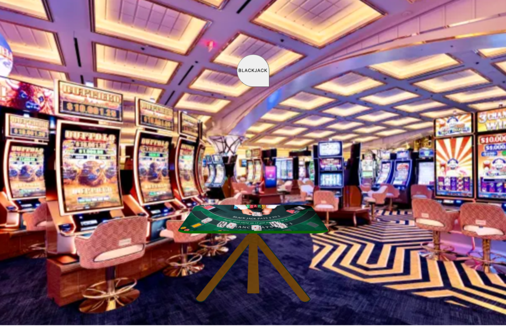
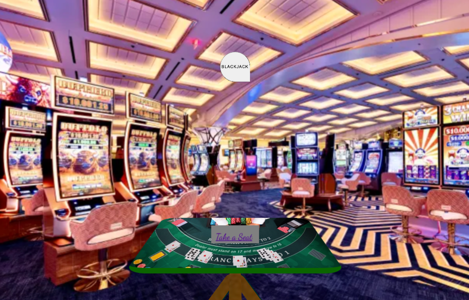
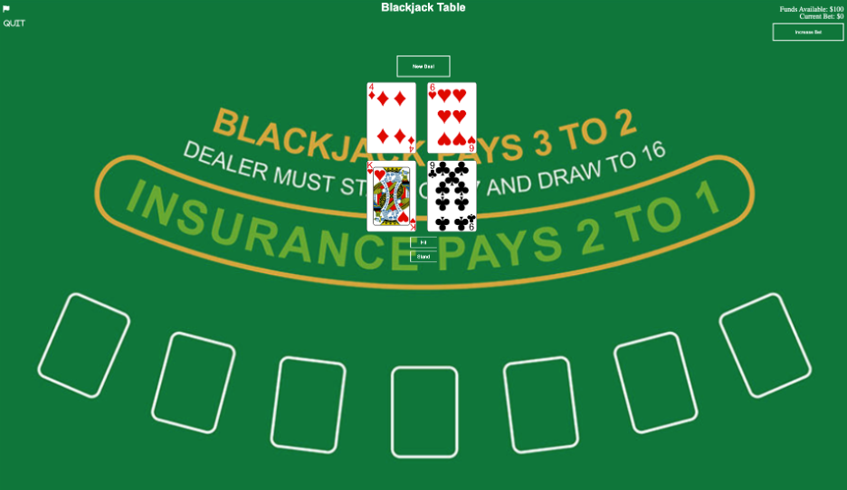

# Project 1 - Blackjack

## Goal

The goal of Project 1 of the Full Stack Software Engineering Immersive bootcamp is to make a simple game using only HTML, CSS, and JavaScript.

I decided to make Blackjack as I have played blackjack games in the past and it seemed like a challange to code not only the game logic but the visuals.

## Game

### Start

Loading the same allows you to enter the Casino. 
After seeing the Blackjack table and clicking on the Blackjack sign you are able to take a seat at the table

### Approach the Table

Taking a seat at the table brings you to the game board. 
This casino was interesting idea I had to expand on in the future to make it a 3D walkable site that you can pick a table and sit at and it would have several casino games, not just blackjack.

### Play Blackjack

Here is the game, you start with $100 and can bet on each hand. All the normal blackjack rules apply. Closest to 21 with out going over wins. The player is the top row of cards and the dealer is the bottom. 
Once you press "stand" the dealer will continue to hit until they are at least at 17. 
Then the game will decide the winner and award or take the money.

## Challenges

Being my first project I ran into several problems including the importance of a diagram to sketch out the project before getting to coding, this resulted in a couple of restarts. Once I got going it was slowly setting up the deck of cards then focusing on the win cases and then finally the ability to re-deal.
